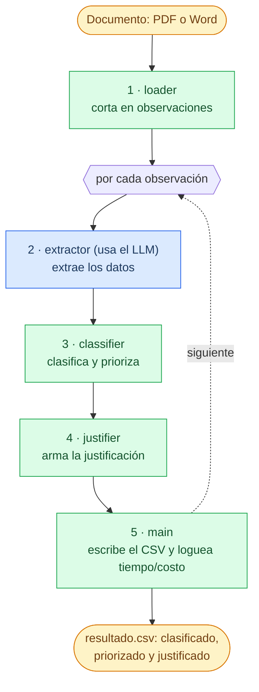

# Agente de triage de observaciones OFAC

Herramienta de línea de comandos que toma un informe del regulador con observaciones de
screening contra la lista **OFAC-SDN** (personas del banco que "matchearon" contra la lista
de sancionados del Tesoro de EE. UU.) y devuelve un **CSV** donde cada caso queda:

- **estructurado** (datos del cliente y del sujeto OFAC, extraídos de la prosa),
- **clasificado** como *falso positivo* o *posible coincidencia real*,
- **priorizado** (baja / media / alta), y
- **justificado** con una frase que un analista de compliance puede leer y firmar.

Mientras corre, muestra el progreso caso por caso con **tiempo y costo** de la corrida.

El input es un documento (PDF o Word) redactado en **prosa irregular**: cada observación
está escrita distinto, con las fechas en varios formatos y los datos del cliente y del
sancionado mezclados. La herramienta funciona con **cualquier** documento de ese tipo, no
solo con el de ejemplo.

---

## Cómo funciona (la idea en una línea)

> El modelo de lenguaje **lee y extrae**; reglas explícitas en Python **deciden**.

El screening por nombre genera muchísimos falsos positivos (homónimos). El trabajo no es
volver a matchear el nombre (eso ya lo hizo el regulador), sino **correlacionar los
identificadores** (fecha de nacimiento, documento, nacionalidad, lugar de nacimiento) para
decidir si es la misma persona, y con qué urgencia hay que revisarla.

Ese juicio lo toma un **árbol de reglas determinista**, no el modelo. Así la decisión es:

- **auditable**: la justificación cita las señales concretas que la fundaron.
- **reproducible**: mismos datos, mismo resultado, siempre.
- **explicable**: cada fila del CSV indica qué regla la produjo.

El modelo se usa **solo** para lo que hace bien: leer cada observación (que viene en prosa,
con los datos del cliente y del sancionado mezclados) y ordenar esos datos en campos separados,
los del cliente por un lado y los del sujeto OFAC por otro, con las fechas en un formato
uniforme. **No toma ninguna decisión**: eso queda para las reglas.

### El pipeline, en pasos

*El paso en azul es el único que usa el modelo de IA; los verdes son Python puro.*



1. **Segmentar** (`loader.py`, sin modelo): extrae el texto del documento y lo corta en
   observaciones. El delimitador de cada caso varía ("Obs. 1", "Observación 2:", "Ítem 3.",
   "Caso 4", "Observación N.º 5"); se detecta con un patrón flexible, sin asumir una cantidad
   fija de observaciones.
2. **Extraer** (`extractor.py`, el agente en Strands): cada observación se convierte en un
   formulario estructurado (`schema.py`) con los datos del cliente y del sujeto OFAC. El modelo
   **no clasifica**: solo lee y normaliza.
3. **Clasificar y priorizar** (`classifier.py`, reglas deterministas): compara los
   identificadores señal por señal y aplica un árbol de decisión explícito.
4. **Justificar** (`justifier.py`): arma la frase legible citando las señales.
5. **Reportar** (`main.py` + `cost.py`): escribe el CSV y muestra el log en vivo con tiempo
   y costo.

### Qué NO usa el agente para decidir

Algunas observaciones incluyen dos números que el banco ya había calculado. El agente los extrae
y los registra en el CSV, pero los **deja fuera de la decisión**, a propósito:

- el **score del motor de screening** (el porcentaje que el sistema del banco le asignó al match
  al detectarlo): mide cuánto se parecen los *nombres*, no si son la misma persona. En el ejemplo
  hay un falso positivo con score 97 % y una coincidencia real con 81 %.
- el **nivel de riesgo interno de la cuenta**: una calificación que el banco le da a la *cuenta*
  (por su historial y movimientos), no a la coincidencia contra la lista.

Ninguno de los dos dice si el cliente es realmente la persona sancionada. Clasificar por el score
llevaría, en varios casos, a la conclusión contraria a la correcta. Por eso el agente los guarda
(para dejar constancia de que los vio) pero decide sobre los identificadores.

---

## Instalación

Requiere **Python 3.11+**.

```bash
# 1. Clonar y entrar al repo
git clone https://github.com/marioconti/ofac-agent.git
cd ofac-agent

# 2. Crear el entorno virtual e instalar dependencias
python -m venv .venv
.venv\Scripts\activate            # Windows
# source .venv/bin/activate       # macOS / Linux
pip install -r requirements.txt

# 3. Configurar la API key de Anthropic
copy .env.example .env            # Windows  (cp en macOS / Linux)
# editar .env y pegar tu clave:  ANTHROPIC_API_KEY=sk-ant-...
```

La API key se saca de <https://console.anthropic.com> (es la API de Anthropic, distinta de
la suscripción de chat). El archivo `.env` está en `.gitignore`: la clave nunca se sube.

---

## Uso

```bash
python -m src.main input/observaciones-ejemplo.pdf
```

Opciones:

| Opción | Qué hace |
|---|---|
| `-o, --output <ruta>` | Ruta del CSV de salida (por defecto `output/resultado.csv`). |
| `-m, --model <id>` | Modelo de Anthropic (por defecto `claude-haiku-4-5`). |
| `-l, --limit <N>` | Procesar solo las primeras N observaciones (útil para probar sin gastar la corrida completa). |

**Input:** un `.pdf` o `.docx` con observaciones numeradas en el formato descrito.
**Output:** un CSV en `output/`, más un resumen en consola con la distribución de casos, el
costo total y la duración.

Ejemplo de log en vivo:

```
[ 5/80] Obs. 5   Pedro David Gallón Henao   → FALSO POSITIVO  (baja ) · R4 ·  1.7s · USD 0.0043
...
==============================================================
  RESUMEN DE LA CORRIDA: 80 observaciones procesadas
  Falsos positivos ........  55
  Posibles reales .........  25
  Prioridad alta ..........  25   <- revisar primero
  ...
  Costo total ............. USD 0.3510
  Duración ................ 4m 48s
==============================================================
```

---

## El CSV de salida

Las columnas siguen el orden en que un analista lee un caso: **primero la decisión**, después
la evidencia, y al final los datos crudos.

| Columna | Contenido |
|---|---|
| `n_observacion` | Número de la observación en el informe. |
| `clasificacion` | `falso positivo` / `posible coincidencia real` (o `ERROR_DE_EXTRACCION`). |
| `prioridad` | `baja` / `media` / `alta`, según la urgencia de la revisión humana. |
| `justificacion` | Frase legible que cita las señales concretas de la decisión. |
| `datos_insuficientes` | `sí` si no había identificadores para confirmar o descartar. |
| `senales_detectadas` | Cada identificador comparado y su estado (confirma / contradice / sin dato). |
| `regla_aplicada` | La regla exacta del árbol que produjo la decisión (trazabilidad). |
| `coincidencia_nombre` | Fuerza del match de nombre (exacto / contenido / parcial / débil). |
| `cliente_*` / `ofac_*` | Datos estructurados del cliente y del sujeto OFAC. |
| `score_motor_no_usado` / `riesgo_interno_no_usado` | Los señuelos: se registran pero **no** se usan para decidir. |

Se escribe en UTF-8 con BOM para que Excel muestre bien los acentos.

En `output/resultado.csv` está el CSV generado a partir del documento de ejemplo.

---

## La lógica de clasificación (resumen)

Cada identificador se compara y cae en **confirma**, **contradice** o **sin dato**. No todos
pesan igual:

- **fuertes** (discriminantes): **documento** y **fecha de nacimiento**, porque dos personas con
  el mismo nombre casi nunca comparten uno de estos por azar.
- **de apoyo** (débiles): **nacionalidad** y **lugar de nacimiento**, que solo acotan el universo
  (medio país comparte una nacionalidad).

El árbol de decisión, en orden (la primera regla que aplica decide):

1. El registro OFAC no es una persona (es un buque/empresa) → **falso positivo, baja**.
2. El match se apoya solo en un alias marcado como débil → **falso positivo, baja**.
3. Coincide el **número de documento** → **posible real, alta** (identificador casi determinante).
4. Un identificador **fuerte contradice** y ninguno confirma → **falso positivo, baja** (homónimo).
5. **Dos o más** identificadores fuertes coinciden → **posible real, alta**.
6. **Un** identificador fuerte coincide → **posible real, media** (alta si el programa es severo).
7. Nombre fuerte pero **sin** identificadores para verificar → **posible real, media** +
   `datos_insuficientes` (alta si el programa es severo).
8. Nombre parcial sin nada que lo confirme → **falso positivo, baja**.
9. El nombre casi no coincide y no hay identificadores → **falso positivo, baja**.

El detalle y el porqué de cada regla están comentados en `src/classifier.py`, y el proceso de
cómo se llegó a este criterio (con evidencia de cada corrida) está en
[`ITERACIONES.md`](ITERACIONES.md).

---

## Robustez

El agente tiene que correr contra **otro** documento del mismo formato sin romperse:

- **Campos faltantes** ("sin documento informado") → se tratan como *sin dato*, no como
  contradicción.
- **Fechas irregulares** ("21-DIC-86", "1971 (aprox.)", "19 de noviembre de 1988") → el modelo
  las normaliza; si solo hay año, se compara a nivel de año.
- **Documento con dígitos transpuestos** → no se cuenta como coincidencia ni como
  contradicción; se marca para que un humano lo mire.
- **Una observación que no se puede extraer** → se registra como `ERROR_DE_EXTRACCION` y la
  corrida **continúa**; nunca se pierde silenciosamente un caso.
- **Cantidad de observaciones distinta a 80, o numeración con huecos** → se respeta lo que el
  documento traiga.
- **Encoding** → todo en UTF-8, forzado también en la consola de Windows.

Los tests (`python -m tests.test_classifier` y `python -m tests.test_loader`) cubren estos
casos y la lógica de clasificación, sin llamar a la API (cero costo).

---

## Supuestos

- **Idioma → español**, porque el usuario final es un analista de compliance argentino: el CSV,
  las justificaciones y este README están en español.
- **Proveedor → Claude (Anthropic).** El agente se construye con Strands, que no obliga a un
  proveedor; se eligió Claude por su calidad extrayendo datos de prosa irregular. El modelo por
  defecto es Haiku 4.5 (una corrida completa cuesta centavos).
- Cada quien corre el agente con su propia API key (va en `.env`, nunca en el repo).

---

## Estructura del proyecto

```
ofac-agent/
├── README.md              ← este archivo
├── ITERACIONES.md         ← las tres iteraciones, con evidencia empírica
├── requirements.txt
├── .env.example
├── src/
│   ├── loader.py          ← documento → texto → observaciones (sin modelo)
│   ├── schema.py          ← el "formulario" que el modelo completa
│   ├── extractor.py       ← el agente en Strands (prosa → campos)
│   ├── classifier.py      ← las reglas de clasificación y prioridad
│   ├── justifier.py       ← la justificación legible
│   ├── cost.py            ← tokens, costo y tiempo
│   └── main.py            ← CLI, orquestación, logging y CSV
├── tests/                 ← tests sin API (clasificador + robustez del loader)
├── input/                 ← el documento de ejemplo
└── output/                ← el CSV generado
```
